# MCP Server - AWS Infrastructure

This Terraform configuration creates a production-ready AWS infrastructure for containerized MCP (Model Context Protocol) server deployments. It features single-region deployment with optional multi-region support via deployment scripts.

## 🏗️ Architecture Overview

The infrastructure is designed as a modern, scalable, and cost-optimized container platform with optional weekend-only scheduling for cost savings.

## 📦 Infrastructure Components

Each AWS region deployment creates the following complete set of resources:

### **Compute & Container Infrastructure (4 resources)**
- **1 ECS Cluster** - Container orchestration platform (`aws_ecs_cluster`)
- **1 ECS Service** - Manages task lifecycle and scaling (`aws_ecs_service`)
- **1 Task Definition** - Container blueprint with CPU/memory specifications (`aws_ecs_task_definition`)
- **2 ECS Tasks** - Running container instances (default `desired_count=2`)

### **Load Balancing & Traffic Management (3 resources)**
- **1 Application Load Balancer (ALB)** - Public-facing traffic distribution (`aws_lb`)
- **1 Target Group** - Routes traffic to healthy ECS tasks (`aws_lb_target_group`)
- **1 ALB Listener** - Handles incoming traffic on port 80 (`aws_lb_listener`)

### **Networking Infrastructure (7 resources)**
- **1 Dedicated VPC** - Isolated network environment (`aws_vpc`)
- **3 Public Subnets** - High availability across multiple AZs (`aws_subnet`)
- **1 Internet Gateway** - Internet access for VPC (`aws_internet_gateway`)
- **1 Route Table** - Routes traffic to/from internet (`aws_route_table`)
- **3 Route Table Associations** - Connect subnets to routing (`aws_route_table_association`)

### **Security (2 resources)**
- **1 ALB Security Group** - Controls inbound traffic (ports 80/443) (`aws_security_group`)
- **1 ECS Tasks Security Group** - Controls container access (port 8001 from ALB only) (`aws_security_group`)

### **Service Discovery (2 resources, if enabled)**
- **1 Service Discovery Namespace** - Private DNS namespace (`aws_service_discovery_private_dns_namespace`)
- **1 Service Discovery Service** - Service registration and health checks (`aws_service_discovery_service`)

### **Monitoring & Logging (1 resource)**
- **1 CloudWatch Log Group** - Centralized container logging (`aws_cloudwatch_log_group`)

### **Security & Secrets (3 resources)**
- **2 IAM Roles** - ECS execution and task roles (`aws_iam_role`)
- **1 Secrets Manager Secret** - Secure API key storage (`aws_secretsmanager_secret`)

**Total Resources per Region: 19-21 resources**

## 🏛️ Architecture Diagram



```mermaid
graph TB
    subgraph "Internet & DNS Layer"
        USER[👤 Users/Clients]
        R53[🌠Route53 DNS<br/>Latency-Based Routing]
    end
    
    subgraph "AWS Region (e.g., eu-west-1)"
        subgraph "VPC: 172.31.0.0/16"
            subgraph "Internet Gateway Layer"
                IGW[🌠Internet Gateway<br/>aws_internet_gateway]
                RT[📋 Route Table<br/>aws_route_table<br/>0.0.0.0/0 → IGW]
            end
            
            subgraph "Public Subnet Layer"
                SUBNET_A[📠Public Subnet A<br/>172.31.0.0/20<br/>eu-west-1a]
                SUBNET_B[📠Public Subnet B<br/>172.31.16.0/20<br/>eu-west-1b]
                SUBNET_C[📠Public Subnet C<br/>172.31.32.0/20<br/>eu-west-1c]
            end
            
            subgraph "Load Balancer Layer"
                ALB[âš–ï¸ Application Load Balancer<br/>aws_lb<br/>internet-facing<br/>Ports: 80, 443]
                
                subgraph "ALB Components"
                    LISTENER[👂 ALB Listener<br/>aws_lb_listener<br/>Port 80 → Target Group]
                    TG[🯠Target Group<br/>aws_lb_target_group<br/>Protocol: HTTP<br/>Port: 8000<br/>Health: /health]
                end
            end
            
            subgraph "Security Layer"
                ALB_SG[🔒 ALB Security Group<br/>aws_security_group<br/>Inbound: 80,443 ↠0.0.0.0/0<br/>Outbound: 8000 → ECS SG]
                ECS_SG[🔒 ECS Security Group<br/>aws_security_group<br/>Inbound: 8001 ↠ALB SG<br/>Outbound: All → 0.0.0.0/0]
            end
            
            subgraph "Container Platform Layer"
                CLUSTER[🳠ECS Cluster<br/>aws_ecs_cluster<br/>Name: app-cluster<br/>Type: Fargate]
                
                SERVICE[âš™ï¸ ECS Service<br/>aws_ecs_service<br/>Desired Count: 2<br/>Launch Type: FARGATE<br/>Network: awsvpc]
                
                TASK_DEF[📋 Task Definition<br/>aws_ecs_task_definition<br/>CPU: 1024 1 vCPU<br/>Memory: 3072 MB<br/>Network: awsvpc]
                
                subgraph "Running Tasks"
                    TASK1[📦 ECS Task 1<br/>Container: app-server<br/>Port: 8001<br/>Status: RUNNING]
                    TASK2[📦 ECS Task 2<br/>Container: app-server<br/>Port: 8001<br/>Status: RUNNING]
                end
            end
            
            subgraph "Service Discovery Layer" 
                SD_NS[ğŸ—ºï¸ Service Discovery Namespace<br/>aws_service_discovery_private_dns_namespace<br/>app-services]
                SD_SVC[📋 Service Discovery Service<br/>aws_service_discovery_service<br/>DNS: app.app-services<br/>TTL: 60s]
            end
            
            subgraph "Monitoring & Logging Layer"
                CW_LOG[📊 CloudWatch Log Group<br/>aws_cloudwatch_log_group<br/>/ecs/app-task<br/>Retention: 7 days]
            end
        end
    end
    
    subgraph "Shared AWS Services"
        SECRETS[🔠Secrets Manager<br/>API_KEY<br/>Region: Primary]
        IAM_EXEC[👤 ECS Execution Role<br/>ECR, CloudWatch, Secrets]
        IAM_TASK[👤 ECS Task Role<br/>Application permissions]
    end
    
    %% Connections
    USER --> R53
    R53 --> ALB
    IGW --> ALB
    ALB --> LISTENER
    LISTENER --> TG
    TG --> TASK1
    TG --> TASK2
    
    %% Network Flow
    SUBNET_A -.-> RT
    SUBNET_B -.-> RT
    SUBNET_C -.-> RT
    RT --> IGW
    
    %% Security
    ALB -.-> ALB_SG
    TASK1 -.-> ECS_SG
    TASK2 -.-> ECS_SG
    ALB_SG --> ECS_SG
    
    %% Container Platform
    CLUSTER --> SERVICE
    SERVICE --> TASK_DEF
    SERVICE --> TASK1
    SERVICE --> TASK2
    
    %% Service Discovery
    SERVICE --> SD_SVC
    SD_SVC --> SD_NS
    TASK1 -.-> SD_SVC
    TASK2 -.-> SD_SVC
    
    %% Monitoring
    TASK1 --> CW_LOG
    TASK2 --> CW_LOG
    
    %% IAM & Secrets
    TASK_DEF --> IAM_EXEC
    TASK_DEF --> IAM_TASK
    TASK1 --> SECRETS
    TASK2 --> SECRETS
    

    
    class CLUSTER,SERVICE,TASK_DEF,TASK1,TASK2 compute
    class IGW,RT,SUBNET_A,SUBNET_B,SUBNET_C,ALB,LISTENER,TG network
    class ALB_SG,ECS_SG,IAM_EXEC,IAM_TASK security
    class CW_LOG,SECRETS,SD_NS,SD_SVC storage
    class USER,R53 external
```

## 🚀 Quick Start Guide

### Prerequisites

1. **AWS CLI configured** with appropriate permissions
2. **Terraform >= 1.0** installed
3. **API Key** for your application
4. **Route53 Hosted Zone** (optional, for custom domain)

### Single Region Deployment

```bash
# 1. Clone and navigate to terraform directory
cd terraform/fmp-mcp-modular

# 2. Copy and configure variables
cp terraform.tfvars.example terraform-my-region.tfvars
# Edit terraform-my-region.tfvars with your values

# 3. Initialize terraform
terraform init

# 4. Plan deployment
terraform plan -var-file="terraform-my-region.tfvars" -out="my-region.tfplan"

# 5. Apply deployment
terraform apply my-region.tfplan

# 6. Get deployment outputs
terraform output
```

### Multi-Region Deployment

For multiple regions, repeat the process with region-specific configuration files:

```bash
# Region 1: EU West 1
terraform plan -var-file="terraform-eu-west-1.tfvars" -state="terraform-eu-west-1.tfstate" -out="eu-west-1.tfplan"
terraform apply -state="terraform-eu-west-1.tfstate" -state-out="terraform-eu-west-1.tfstate" eu-west-1.tfplan

# Region 2: EU West 2  
terraform plan -var-file="terraform-eu-west-2.tfvars" -state="terraform-eu-west-2.tfstate" -out="eu-west-2.tfplan"
terraform apply -state="terraform-eu-west-2.tfstate" -state-out="terraform-eu-west-2.tfstate" eu-west-2.tfplan
```

### Setting up API Keys

After deployment, set your API key in AWS Secrets Manager:

```bash
# Get the secret ARN from terraform output
SECRET_ARN=$(terraform output -raw secret_arn)

# Update the secret value
aws secretsmanager put-secret-value \
  --secret-id $SECRET_ARN \
  --secret-string '{"API_KEY":"your-actual-api-key-here"}'

# Restart ECS tasks to pick up new secret
aws ecs update-service \
  --cluster $(terraform output -raw ecs_cluster_name) \
  --service $(terraform output -raw ecs_service_name) \
  --force-new-deployment
```

## 📊 Configuration Variables

### Core Settings
```hcl
project_name = "my-app"
environment  = "dev"
aws_region   = "eu-west-1"
```

### Application Settings
- `container_image`: Docker image (default: "ghcr.io/cdtait/fmp-mcp-server:latest")
- `container_port`: Container port (default: 8001)
- `cpu`: CPU units (default: 1024)
- `memory`: Memory in MB (default: 3072)
- `desired_count`: Number of tasks per region (default: 2)

### Domain Settings
- `enable_domain`: Enable custom domain (default: true)
- `domain_name`: Route53 hosted zone (default: "cdtait.cloud")
- `subdomain`: Subdomain prefix (default: "fmp")

## 🛠️ Management Scripts

### Weekend Scheduler (`scripts/weekend-scheduler.sh`)

Interactive management tool for weekend-only operations:

```bash
# Interactive menu
./scripts/weekend-scheduler.sh

# Direct commands
./scripts/weekend-scheduler.sh check-time
./scripts/weekend-scheduler.sh scale-up-weekend
./scripts/weekend-scheduler.sh scale-down-all
```

**Menu Options:**
1. Check current weekend schedule status
2. Enable weekend-only mode (keep ALBs)
3. Enable weekend-only mode (destroy ALBs)
4. Disable weekend-only mode
5. Manual scale up for weekend
6. Manual scale down all regions
7. Show cost estimates
8. Setup cron automation

### Cost Management (`scripts/cost-management.sh`)

Comprehensive cost analysis and scaling options:

```bash
# Interactive cost management
./scripts/cost-management.sh
```

**Features:**
- Real-time cost analysis
- Scaling scenario comparisons
- Regional cost breakdowns
- Automated cost optimization recommendations

### Network Configuration
```hcl
vpc_cidr             = "172.31.0.0/16"
availability_zones   = ["eu-west-1a", "eu-west-1b", "eu-west-1c"]
subnet_cidrs        = ["172.31.0.0/20", "172.31.16.0/20", "172.31.32.0/20"]
```

### Container Configuration
```hcl
container_image = "ghcr.io/your-org/your-app:latest"
container_port  = 8001
cpu             = 1024  # 1 vCPU
memory          = 3072  # 3 GB
desired_count   = 2     # Number of tasks
```

### Domain Configuration (Optional)
```hcl
enable_domain = true
domain_name   = "your-domain.com"
subdomain     = "api"    # Creates api.your-domain.com
```

### Weekend Scheduling (Cost Optimization)
```hcl
enable_weekend_only               = false  # Set to true for weekend-only operation
destroy_albs_when_scaled_down    = false  # Set to true for maximum cost savings
weekend_hours_start              = 6      # 6 AM UTC
weekend_hours_end                = 22     # 10 PM UTC
```

## 🔧 Management Operations

### Health Monitoring

```bash
# Check ECS service status
aws ecs describe-services \
  --cluster $(terraform output -raw ecs_cluster_name) \
  --services $(terraform output -raw ecs_service_name)

# View application logs
aws logs tail $(terraform output -raw cloudwatch_log_group_name) --follow

# Check load balancer target health
aws elbv2 describe-target-health \
  --target-group-arn $(aws elbv2 describe-load-balancers \
    --names $(terraform output -raw ecs_cluster_name | sed 's/cluster/alb/') \
    --query 'LoadBalancers[0].LoadBalancerArn' --output text | \
    xargs aws elbv2 describe-target-groups --load-balancer-arn | \
    jq -r '.TargetGroups[0].TargetGroupArn')
```

### Application Access

```bash
# Get application URL
echo "Application URL: $(terraform output -raw application_url)"

# Test health endpoint
curl $(terraform output -raw application_url)/health

# Test API endpoint (adjust path as needed)
curl $(terraform output -raw application_url)/api/
```

### Scaling Operations

```bash
# Scale task count
terraform apply -var-file="terraform-my-region.tfvars" -var="desired_count=4"

# Scale CPU/Memory
terraform apply -var-file="terraform-my-region.tfvars" -var="cpu=2048" -var="memory=4096"

# Emergency scale down
terraform apply -var-file="terraform-my-region.tfvars" -var="desired_count=0"
```

### Cost Management

```bash
# Enable weekend-only mode
terraform apply -var-file="terraform-my-region.tfvars" \
  -var="enable_weekend_only=true" \
  -var="destroy_albs_when_scaled_down=false"

# Manual weekend scaling
aws ecs update-service \
  --cluster $(terraform output -raw ecs_cluster_name) \
  --service $(terraform output -raw ecs_service_name) \
  --desired-count 2

# Manual scale down
aws ecs update-service \
  --cluster $(terraform output -raw ecs_cluster_name) \
  --service $(terraform output -raw ecs_service_name) \
  --desired-count 0
```

## 🌐 Multi-Region Setup with Route53

For global deployment with latency-based routing:

```bash
# 1. Deploy to multiple regions
terraform apply -var-file="terraform-eu-west-1.tfvars" \
  -state="terraform-eu-west-1.tfstate" \
  -state-out="terraform-eu-west-1.tfstate"

terraform apply -var-file="terraform-eu-west-2.tfvars" \
  -state="terraform-eu-west-2.tfstate" \
  -state-out="terraform-eu-west-2.tfstate"

# 2. Check Route53 records are created
aws route53 list-resource-record-sets \
  --hosted-zone-id $(aws route53 list-hosted-zones \
    --query 'HostedZones[?Name==`your-domain.com.`].Id' \
    --output text | cut -d/ -f3)

# 3. Test latency-based routing
curl -H "Host: api.your-domain.com" http://api.your-domain.com/health
```

## 🔧 Troubleshooting

### Common Issues

| Issue | Symptoms | Solution |
|-------|----------|----------|
| **Tasks not starting** | ECS shows pending tasks | Check IAM roles, security groups, secrets |
| **Health checks failing** | ALB shows unhealthy targets | Verify `/health` endpoint returns HTTP 200 |
| **Cannot access application** | Connection timeouts | Check security group rules, VPC routing |
| **Secrets not accessible** | Container startup errors | Verify IAM permissions for Secrets Manager |

### Debug Commands

```bash
# ECS service events
aws ecs describe-services \
  --cluster $(terraform output -raw ecs_cluster_name) \
  --services $(terraform output -raw ecs_service_name) \
  --query 'services[0].events'

# View task logs
aws logs get-log-events \
  --log-group-name $(terraform output -raw cloudwatch_log_group_name) \
  --log-stream-name "ecs/$(terraform output -raw ecs_service_name)/$(aws ecs list-tasks \
    --cluster $(terraform output -raw ecs_cluster_name) \
    --service $(terraform output -raw ecs_service_name) \
    --query 'taskArns[0]' --output text | cut -d/ -f3)"

# Security group audit
aws ec2 describe-security-groups \
  --group-ids $(terraform output -raw ecs_security_group_id)
```

## 💰 Cost Analysis

### Typical Monthly Costs (2 tasks, 1 vCPU, 3GB memory)

| Component | 24/7 Cost | Weekend-Only Cost |
|-----------|-----------|-------------------|
| **Fargate Tasks** | $78.57 | $11.12 |
| **Application Load Balancer** | $16.43 | $16.43 (kept) or $2.33 (weekend) |
| **Other Services** | $2.50 | $2.50 |
| **Total per Region** | $97.50 | $30.05 (keep ALB) / $16.95 (weekend ALB) |

**Savings: 69-83% with weekend-only mode**

## 🌐 Multi-Region Architecture



## 🚀 Key Features

### Multi-Region Architecture
- **3 AWS Regions**: eu-west-1, eu-west-2, us-east-1
- **Latency-Based Routing**: Route53 directs users to closest region
- **Independent VPCs**: Isolated networks per region
- **Global Load Balancing**: Automatic failover and traffic distribution

### Cost Management & Optimization
- **Weekend-Only Scheduling**: Massive cost savings with intelligent scaling
- **Dynamic Task Scaling**: Scale regions to 0 when not needed
- **ALB Management**: Option to keep or destroy load balancers during downtime
- **Cost Analysis**: Real-time cost calculations and projections

### Enterprise Security
- **Dedicated VPCs**: Isolated networks with custom CIDR ranges
- **IAM Best Practices**: Least-privilege access with service-specific roles
- **Secrets Management**: AWS Secrets Manager for API keys
- **Security Groups**: Fine-grained network access control

### Operational Excellence
- **Service Discovery**: AWS Cloud Map for internal service communication
- **Health Monitoring**: Comprehensive health checks and monitoring
- **Centralized Logging**: CloudWatch integration with structured logging
- **Automated Management**: Scripts for scaling and cost management

## 📊 Cost Analysis & Weekend Scheduling

### Current Cost Structure


### Weekend-Only Mode Savings

| Configuration | Monthly Cost | Annual Cost | Savings |
|---------------|--------------|-------------|---------|
| **3 Regions 24/7** | $284.77 | $3,417 | Baseline |
| **Weekend Only (Keep ALBs)** | $31.34 | $376 | $253.43/month (89%) |
| **Weekend Only (Destroy ALBs)** | $22.00 | $264 | $262.77/month (92%) |
| **Single Region 24/7** | $95.00 | $1,140 | $189.77/month 67% |

### Weekend Scheduling Logic


## 🌐 Network Architecture


## 🐳 Container & ECS Architecture

```mermaid
graph TB
    subgraph "ECS Architecture"
        subgraph "ECS Cluster"
            CLUSTER[🏗️ fmp-mcp-cluster]
        end
        
        subgraph "Task Definition"
            TASK_DEF[📋 Task Definition<br/>CPU: 1024 1 vCPU <br/>Memory: 3072 MB]
            CONTAINER[📦 Container<br/>Image: ghcr.io/cdtait/fmp-mcp-server:latest<br/>Port: 8001]
        end
        
        subgraph "ECS Service"
            SERVICE[⚙️ ECS Service<br/>Launch Type: Fargate<br/>Desired Count: 2<br/>Platform Version: LATEST]
            
            subgraph "Deployment Config"
                DEPLOY[🚀 Deployment<br/>Max %: 200<br/>Min Healthy %: 100<br/>Circuit Breaker: Enabled]
            end
            
            subgraph "Network Config"
                NETWORK[🔗 Network<br/>VPC Mode: awsvpc<br/>Security Groups: ECS SG<br/>Subnets: Public<br/>Public IP: Enabled]
            end
        end
        
        subgraph "Running Tasks"
            TASK1[📦 Task 1<br/>Status: Running<br/>Health: Healthy]
            TASK2[📦 Task 2<br/>Status: Running<br/>Health: Healthy]
        end
        
        subgraph "IAM Roles"
            EXEC_ROLE[👤 Execution Role<br/>- ECS Task Execution<br/>- CloudWatch Logs<br/>- Secrets Manager]
            TASK_ROLE[👤 Task Role<br/>- Application Permissions<br/>- AWS SDK Access]
        end
        
        subgraph "Secrets & Config"
            SECRETS[🔐 Secrets Manager<br/>FMP_API_KEY: ****]
            ENV_VARS[⚙️ Environment<br/>PORT: 8001<br/>STATELESS: true<br/>TRANSPORT: streamable-http]
        end
        
        subgraph "Logging"
            LOGS[📊 CloudWatch Logs<br/>Group: /ecs/fmp-mcp-dev-task<br/>Retention: 7 days<br/>Mode: non-blocking]
        end
    end
    
    CLUSTER --> SERVICE
    SERVICE --> TASK_DEF
    SERVICE --> DEPLOY
    SERVICE --> NETWORK
    SERVICE --> TASK1
    SERVICE --> TASK2
    
    TASK_DEF --> CONTAINER
    TASK_DEF --> EXEC_ROLE
    TASK_DEF --> TASK_ROLE
    
    CONTAINER --> SECRETS
    CONTAINER --> ENV_VARS
    CONTAINER --> LOGS
```



## ⚖️ Load Balancer & Health Check Architecture

```mermaid
graph TB
    subgraph "Internet"
        USER[👤 Users]
        DNS[🌐 fmp.cdtait.cloud]
    end
    
    subgraph "Route 53"
        R53[📍 Route 53<br/>Latency-Based Routing]
        R53_EU1[🇪🇺 EU-West-1 Record<br/>Set ID: eu-west-1]
        R53_EU2[🇪🇺 EU-West-2 Record<br/>Set ID: eu-west-2]
        R53_US1[🇺🇸 US-East-1 Record<br/>Set ID: us-east-1]
    end
    
    subgraph "Application Load Balancer"
        ALB[⚖️ ALB<br/>Scheme: internet-facing<br/>Type: application<br/>IP Address Type: ipv4]
        
        subgraph "Listeners"
            LISTENER[👂 HTTP Listener<br/>Port: 80<br/>Protocol: HTTP]
        end
        
        subgraph "Target Group"
            TG[🎯 Target Group<br/>Port: 8000<br/>Protocol: HTTP<br/>Target Type: ip<br/>VPC: Custom]
            
            subgraph "Health Checks"
                HC[🏥 Health Check<br/>Path: /health<br/>Protocol: HTTP<br/>Port: 8000<br/>Interval: 30s<br/>Timeout: 5s<br/>Healthy Threshold: 5<br/>Unhealthy Threshold: 2<br/>Matcher: 200]
            end
            
            subgraph "Targets"
                TARGET1[📦 Target 1<br/>IP: 172.31.x.x<br/>Port: 8000<br/>Status: healthy]
                TARGET2[📦 Target 2<br/>IP: 172.31.x.x<br/>Port: 8000<br/>Status: healthy]
            end
        end
        
        subgraph "Security"
            ALB_SG[🔒 ALB Security Group<br/>Inbound: 80,443/tcp → 0.0.0.0/0<br/>Outbound: 8000/tcp → ECS SG]
        end
    end
    
    subgraph "ECS Tasks"
        TASK1[📦 ECS Task 1<br/>Container Port: 8001<br/>Host Port: 8001<br/>Health Endpoint: /health]
        TASK2[📦 ECS Task 2<br/>Container Port: 8001<br/>Host Port: 8001<br/>Health Endpoint: /health]
        
        subgraph "Task Security"
            ECS_SG[🔒 ECS Security Group<br/>Inbound: 8000/tcp → ALB SG<br/>Outbound: All → 0.0.0.0/0]
        end
    end
    
    USER --> DNS
    DNS --> R53
    R53 --> R53_EU1
    R53 --> R53_EU2
    R53 --> R53_US1
    
    R53_EU1 --> ALB
    R53_EU2 --> ALB
    R53_US1 --> ALB
    
    ALB --> LISTENER
    LISTENER --> TG
    TG --> HC
    TG --> TARGET1
    TG --> TARGET2
    
    TARGET1 --> TASK1
    TARGET2 --> TASK2
    
    ALB_SG --> ECS_SG
```



## 🔐 Security & IAM Architecture

```mermaid
graph TB
    subgraph "IAM Roles & Policies"
        subgraph "ECS Execution Role"
            EXEC_ROLE[👤 ECS Task Execution Role<br/>fmp-mcp-dev-ecs-task-execution-role]
            
            subgraph "Execution Policies"
                ECS_POLICY[📜 AmazonECSTaskExecutionRolePolicy<br/>- ECR Image Pulls<br/>- CloudWatch Logs]
                CW_POLICY[📜 CloudWatch Logs Policy<br/>- CreateLogGroup<br/>- CreateLogStream<br/>- PutLogEvents]
                SM_POLICY[📜 Secrets Manager Policy<br/>- GetSecretValue<br/>- DescribeSecret]
            end
        end
        
        subgraph "ECS Task Role"
            TASK_ROLE[👤 ECS Task Role<br/>fmp-mcp-dev-ecs-task-role]
            
            subgraph "Task Policies"
                APP_POLICY[📜 Application Policy<br/>- Custom app permissions<br/>- AWS SDK access]
            end
        end
    end
    
    subgraph "Secrets Management"
        SM[🔐 AWS Secrets Manager]
        SECRET[🔑 FMP API Key Secret<br/>Name: fmp-mcp-dev-api-key<br/>Type: SecretString<br/>Key: FMP_API_KEY]
    end
    
    subgraph "Network Security"
        subgraph "Security Groups"
            ALB_SG[🔒 ALB Security Group<br/>sg-xxxxxxxxx]
            ECS_SG[🔒 ECS Security Group<br/>sg-yyyyyyyyy]
        end
        
        subgraph "ALB Rules"
            ALB_IN[📥 Inbound Rules<br/>HTTP: 80/tcp → 0.0.0.0/0<br/>HTTPS: 443/tcp → 0.0.0.0/0]
            ALB_OUT[📤 Outbound Rules<br/>HTTP: 8000/tcp → ECS SG]
        end
        
        subgraph "ECS Rules"
            ECS_IN[📥 Inbound Rules<br/>App: 8000/tcp → ALB SG]
            ECS_OUT[📤 Outbound Rules<br/>All: → 0.0.0.0/0]
        end
    end
    
    subgraph "Container Security"
        CONTAINER[📦 Container<br/>- Non-root user<br/>- Read-only filesystem<br/>- Minimal base image]
        
        subgraph "Runtime Security"
            NO_PRIV[🚫 No Privileged Mode]
            NO_ROOT[🚫 Non-root User]
            RO_FS[🔒 Read-only Filesystem]
        end
    end
    
    EXEC_ROLE --> ECS_POLICY
    EXEC_ROLE --> CW_POLICY
    EXEC_ROLE --> SM_POLICY
    
    TASK_ROLE --> APP_POLICY
    
    SM --> SECRET
    EXEC_ROLE --> SM
    
    ALB_SG --> ALB_IN
    ALB_SG --> ALB_OUT
    ECS_SG --> ECS_IN
    ECS_SG --> ECS_OUT
    
    ALB_OUT --> ECS_IN
    
    CONTAINER --> NO_PRIV
    CONTAINER --> NO_ROOT
    CONTAINER --> RO_FS
```



## 🗺️ Service Discovery & Internal Networking

```mermaid
graph TB
    subgraph "AWS Cloud Map Service Discovery"
        subgraph "Private DNS Namespace"
            NAMESPACE[🗺️ Private DNS Namespace<br/>Name: fmp-mcp-dev-services<br/>VPC: vpc-xxxxxxxxx]
        end
        
        subgraph "Service Registry"
            SERVICE_REG[📋 Service Registry<br/>Name: fmp-mcp-service<br/>DNS: fmp-mcp-service.fmp-mcp-dev-services]
            
            subgraph "Service Configuration"
                DNS_CONFIG[⚙️ DNS Configuration<br/>Type: A<br/>TTL: 60 seconds<br/>Routing Policy: MULTIVALUE]
                HEALTH_CONFIG[🏥 Health Check Config<br/>Type: HTTP<br/>Failure Threshold: 1]
            end
        end
        
        subgraph "Service Instances"
            INSTANCE1[📍 Service Instance 1<br/>IP: 172.31.x.x<br/>Port: 8001<br/>Status: HEALTHY]
            INSTANCE2[📍 Service Instance 2<br/>IP: 172.31.x.x<br/>Port: 8001<br/>Status: HEALTHY]
        end
    end
    
    subgraph "ECS Integration"
        subgraph "ECS Service"
            ECS_SERVICE[⚙️ ECS Service<br/>Service Registries Enabled]
            
            subgraph "Tasks"
                TASK1[📦 Task 1<br/>Auto-registered<br/>IP: 172.31.x.x]
                TASK2[📦 Task 2<br/>Auto-registered<br/>IP: 172.31.x.x]
            end
        end
        
        subgraph "Automatic Registration"
            AUTO_REG[🔄 Auto Registration<br/>- Task Start → Register<br/>- Task Stop → Deregister<br/>- Health Check Integration]
        end
    end
    
    subgraph "Internal DNS Resolution"
        CLIENT[👥 Client Services]
        DNS_QUERY[🔍 DNS Query<br/>fmp-mcp-service.fmp-mcp-dev-services]
        DNS_RESPONSE[📝 DNS Response<br/>172.31.x.x, 172.31.y.y]
        
        subgraph "Load Balancing"
            ROUND_ROBIN[🔄 Round Robin<br/>Automatic load balancing<br/>across healthy instances]
        end
    end
    
    NAMESPACE --> SERVICE_REG
    SERVICE_REG --> DNS_CONFIG
    SERVICE_REG --> HEALTH_CONFIG
    SERVICE_REG --> INSTANCE1
    SERVICE_REG --> INSTANCE2
    
    ECS_SERVICE --> AUTO_REG
    TASK1 --> INSTANCE1
    TASK2 --> INSTANCE2
    
    CLIENT --> DNS_QUERY
    DNS_QUERY --> DNS_RESPONSE
    DNS_RESPONSE --> ROUND_ROBIN
    ROUND_ROBIN --> TASK1
    ROUND_ROBIN --> TASK2
```



## 💰 Cost Management & Weekend Scheduler

```mermaid
flowchart TD
    subgraph "Cost Management System"
        subgraph "Weekend Scheduler"
            SCHEDULER[🕐 Weekend Scheduler<br/>Scripts: weekend-scheduler.sh<br/>Interactive menu & automation]
            
            TIME_CHECK[⏰ Time Check Function<br/>Current: UTC time<br/>Weekend: Sat-Sun 6:00-22:00]
            
            SCALING_LOGIC[⚖️ Scaling Logic<br/>Weekend Mode: eu-west-2 only<br/>Weekday Mode: All regions → 0]
        end
        
        subgraph "Cost Calculator"
            COST_CALC[💰 Cost Calculator<br/>Real-time cost analysis<br/>Scenario comparisons]
            
            FARGATE_COST[📊 Fargate Costs<br/>CPU: $0.04048/vCPU/hour<br/>Memory: $0.004445/GB/hour]
            
            ALB_COST[📊 ALB Costs<br/>Fixed: $16.43/month<br/>LCU: $0.008/hour]
        end
        
        subgraph "Management Options"
            KEEP_ALB[🏗️ Keep ALBs Running<br/>Cost: ~$67/month<br/>Benefit: Faster startup]
            
            DESTROY_ALB[💥 Destroy ALBs<br/>Cost: ~$22/month<br/>Benefit: Maximum savings]
        end
    end
    
    subgraph "Automation & Cron"
        CRON_SETUP[⚙️ Cron Automation<br/>Saturday 06 00 Scale up<br/>Sunday 22 00 Scale down]
        
        MANUAL_CONTROL[🎮 Manual Control<br/>Interactive menu<br/>Emergency scaling]
    end
    
    subgraph "Cost Scenarios"
        SCENARIO1[📈 3 Regions 24/7<br/>Monthly: $284.77<br/>Annual: $3,417]
        
        SCENARIO2[📈 Weekend Only Keep ALBs<br/>Monthly: $31.34<br/>Annual: $376<br/>Savings: 89%]
        
        SCENARIO3[📈 Weekend Only Destroy ALBs<br/>Monthly: $22.00<br/>Annual: $264<br/>Savings: 92%]
    end
    
    TIME_CHECK --> SCALING_LOGIC
    SCALING_LOGIC --> KEEP_ALB
    SCALING_LOGIC --> DESTROY_ALB
    
    COST_CALC --> FARGATE_COST
    COST_CALC --> ALB_COST
    
    SCHEDULER --> CRON_SETUP
    SCHEDULER --> MANUAL_CONTROL
    
    COST_CALC --> SCENARIO1
    COST_CALC --> SCENARIO2
    COST_CALC --> SCENARIO3
```




## 📈 Monitoring & Operations

### Health Monitoring

```bash
# Check ECS service status
aws ecs describe-services --cluster $(terraform output -raw ecs_cluster_id) --services $(terraform output -raw ecs_service_name)

# View application logs
aws logs tail $(terraform output -raw cloudwatch_log_group_name) --follow

# Check load balancer health
aws elbv2 describe-target-health --target-group-arn $(terraform output -raw target_group_arn)
```

### Application Access

```bash
# Get application URLs
terraform output application_url          # ALB URL
terraform output custom_domain_url        # Custom domain (if enabled)

# Test health endpoint
curl $(terraform output -raw application_url)/health

# Test MCP endpoint
curl $(terraform output -raw application_url)/mcp/
```

### Scaling Operations

```bash
# Scale task count
terraform apply -var="desired_count=4"

# Scale CPU/Memory
terraform apply -var="cpu=2048" -var="memory=4096"

# Emergency scale down
terraform apply -var="desired_count=0"
```

## 🔧 Troubleshooting

### Common Issues

| Issue | Symptoms | Solution |
|-------|----------|----------|
| **Tasks not starting** | ECS shows pending tasks | Check IAM roles, security groups, secrets |
| **Health checks failing** | ALB shows unhealthy targets | Verify `/health` endpoint returns HTTP 200 |
| **Cannot access application** | Connection timeouts | Check security group rules, VPC routing |
| **Weekend mode not working** | Incorrect scaling behavior | Verify weekend schedule variables and time zones |
| **High costs** | Unexpected billing | Check weekend mode status, review cost analysis |

### Debug Commands

```bash
# ECS service events
aws ecs describe-services --cluster $(terraform output -raw ecs_cluster_id) --services $(terraform output -raw ecs_service_name) --query 'services[0].events'

# Task definitions
aws ecs describe-task-definition --task-definition $(terraform output -raw ecs_task_definition_arn)

# Security group audit
aws ec2 describe-security-groups --group-ids $(terraform output -raw ecs_security_group_id)

# Route53 records
aws route53 list-resource-record-sets --hosted-zone-id $(terraform output -raw route53_zone_id)
```

## 🚀 Advanced Features

### Multi-Environment Support

```bash
# Development environment
terraform workspace new dev
terraform apply -var-file="environments/dev.tfvars"

# Production environment
terraform workspace new prod
terraform apply -var-file="environments/prod.tfvars"
```

### CI/CD Integration

```yaml
# .github/workflows/deploy.yml
name: Deploy Infrastructure
on:
  push:
    branches: [main]
    paths: ['terraform/**']

jobs:
  terraform:
    runs-on: ubuntu-latest
    steps:
      - uses: hashicorp/setup-terraform@v2
      - name: Terraform Apply
        run: |
          terraform init
          terraform plan
          terraform apply -auto-approve
```

### Backup & Recovery

```bash
# Backup current state
terraform show -json > backup-$(date +%Y%m%d-%H%M%S).json

# Import existing resources
terraform import aws_ecs_cluster.main existing-cluster-name

# Force resource recreation
terraform taint aws_ecs_service.main
terraform apply
```

## 📚 File Structure


```
terraform/fmp-mcp-modular/
├── main.tf                      # Provider configuration
├── variables.tf                 # Variable declarations
├── outputs.tf                   # Output definitions
├── ecs.tf                       # ECS cluster, service, tasks
├── network.tf                   # VPC, subnets, security groups
├── load_balancer.tf             # ALB, target groups, listeners
├── iam.tf                       # IAM roles and policies
├── secrets.tf                   # Secrets Manager integration
├── service_discovery.tf         # AWS Cloud Map configuration
├── route53.tf                   # Route53 DNS integration
├── weekend-schedule.tf          # Weekend-only scheduling logic
├── terraform.tfvars.example     # Sample configuration template
├── terraform-eu-west-1.tfvars   # EU West 1 configuration
├── terraform-eu-west-2.tfvars   # EU West 2 configuration
└── README.md                    # This file
```

## 🔒 Security Best Practices

### Network Security
- **Dedicated VPCs** with custom CIDR ranges per region
- **Security Groups** with least-privilege access (ALB → ECS only)
- **Public subnets** for ALB only, ECS tasks use public IPs for internet access
- **No direct SSH access** to containers (use ECS Exec if needed)

### IAM Security
- **Separate roles** for ECS execution vs. application runtime
- **Minimal permissions** following AWS best practices
- **Service-linked roles** for AWS service integrations
- **No hardcoded credentials** in code or configuration

### Secrets Management
- **AWS Secrets Manager** for API keys and sensitive data
- **Automatic rotation** capabilities (can be enabled)
- **Encryption at rest and in transit**
- **Fine-grained IAM access** to secrets

## 🔄 Cleanup

### Single Region Cleanup

```bash
# Scale down to zero first (optional, for faster cleanup)
terraform apply -var-file="terraform-my-region.tfvars" -var="desired_count=0"

# Destroy all resources
terraform destroy -var-file="terraform-my-region.tfvars"
```

### Multi-Region Cleanup

```bash
# Destroy each region separately
terraform destroy -var-file="terraform-eu-west-1.tfvars" \
  -state="terraform-eu-west-1.tfstate"

terraform destroy -var-file="terraform-eu-west-2.tfvars" \
  -state="terraform-eu-west-2.tfstate"

# Clean up Route53 records if needed
aws route53 change-resource-record-sets \
  --hosted-zone-id YOUR_ZONE_ID \
  --change-batch file://delete-records.json
```

### Clean State Files

```bash
# Remove all terraform state and cache files
rm -rf .terraform/
rm -f .terraform.lock.hcl
rm -f terraform*.tfstate*
rm -f terraform*.tfplan
```

This infrastructure provides a robust, cost-effective, and scalable foundation for containerized applications with enterprise-grade features and intelligent cost management.